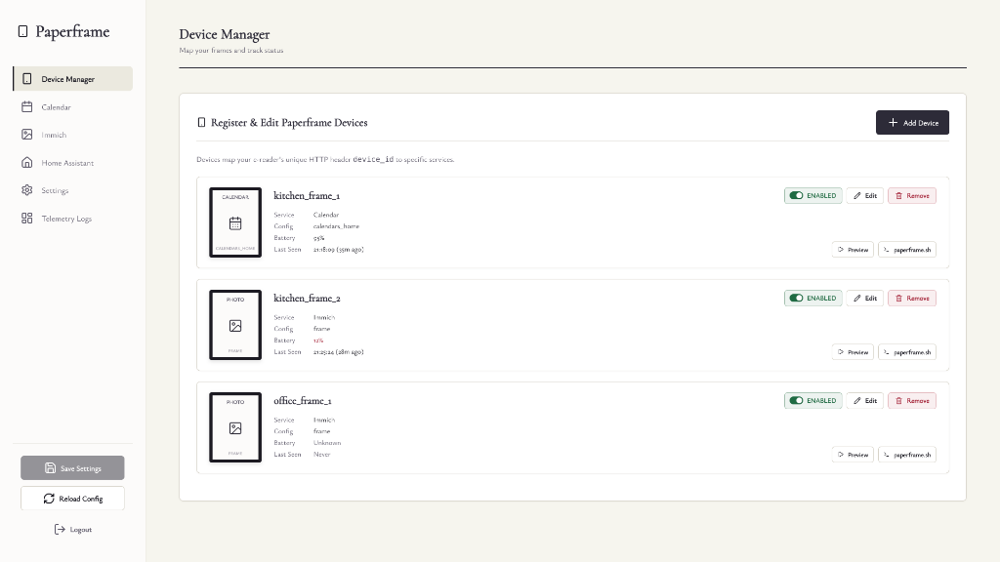

# Paperframe

Self-hosted e-ink dashboard server for jailbroken Kindles. Turns old Kindles into low-power calendar displays or photo frames.



The server generates shell scripts with [FBInk](https://github.com/NiLuJe/FBInk) framebuffer commands. The Kindle runs a lightweight loop — fetch script, execute, deep sleep for configured time. No browser, no rendering engine on the device. Tested on Paperwhites (6th and 7th gen), battery lasts up to 2 months.

## How it works

```
Kindle                          Server                      External
  |                               |                           |
  |-- GET / (device_id, battery)-->|                           |
  |                               |-- update HA entities ----->|
  |                               |-- fetch calendar/photos -->|
  |                               |<-- ical data / images -----|
  |<-- 302 to /calendar/{id} -----|                           |
  |-- GET /calendar/{id} -------->|                           |
  |<-- shell script (fbink cmds)--|                           |
  |                               |                           |
  [execute script, draw to screen]                            |
  [rtcwake sleep 2h]                                          |
```

## Features

- **Calendar** — fetches iCal feeds, renders events for 14 days with localized headers
- **Photo frame** — pulls from [Immich](https://immich.app), dithers/scales with ImageMagick for e-ink
- **Home Assistant** — reports battery level and last-seen timestamp per device
- **Web manager** — configure devices, calendars, integrations, preview scripts, download client

## Quick start (Docker)

```yaml
# docker-compose.yml
services:
  paperframe:
    image: ghcr.io/kiwiprojekt/paperframe:latest
    ports:
      - "8089:8080"
    volumes:
      - paperframe_config:/app/config
    restart: unless-stopped

volumes:
  paperframe_config:
```

```bash
docker compose up -d
```

Open `http://your-server:8089` in a browser to access the manager UI. Configuration persists in the mounted `config/` directory.

## Configuration

On first run, a default `appsettings.json` is created in `/app/config/`. Edit it or use the web manager.

```json
{
  "Configuration": {
    "Devices": {},
    "Calendar": {},
    "Immich": {},
    "HomeAssistant": {
      "ApiUrl": "",
      "OAuthBearerToken": ""
    },
    "Settings": {
      "ServerAddress": "",
      "EnableCalendar": true,
      "EnableImmich": true,
      "EnableHomeAssistant": true,
      "ManagerPassword": ""
    }
  }
}
```

## Kindle setup

Requirements: jailbroken Kindle with [FBInk](https://github.com/NiLuJe/FBInk) installed. (The configuration defaults to fbink installed in /mnt/us/libkh/bin/fbink)

1. Add your device in the web manager
2. Click "Download Client Script" for your device
3. Copy `paperframe.sh` to `/mnt/us/documents/` on the Kindle
4. Run it:
   ```sh
   chmod +x /mnt/us/documents/paperframe.sh
   nohup /mnt/us/documents/paperframe.sh > /dev/null 2>&1 &
   ```

The script disables the screensaver, fetches and executes the server's script, then enters deep sleep via `rtcwake`. Battery lasts weeks to months.

## Building from source

```bash
cd paperframe-server
dotnet restore
dotnet build
dotnet run
```

Requires [.NET 10 SDK](https://dotnet.microsoft.com/download/dotnet/10.0).

## License

MIT
