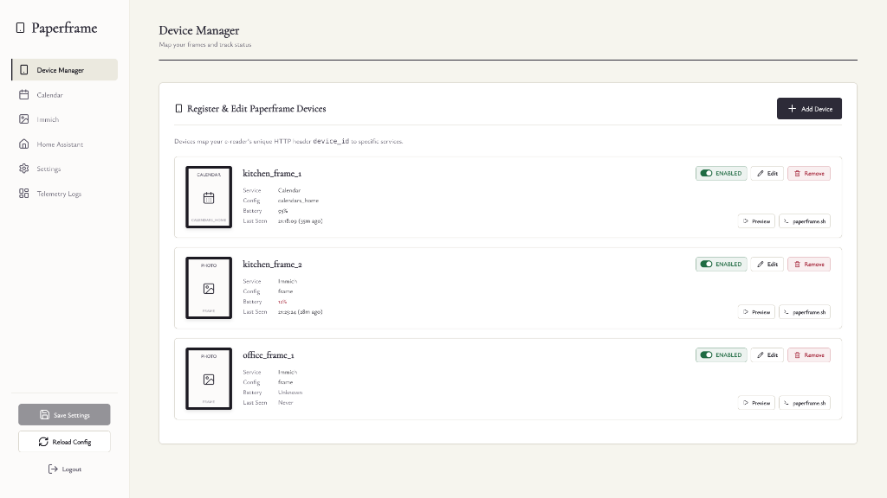

# Paperframe

Self-hosted e-ink dashboard server for jailbroken Kindles. Turns old Kindles into low-power calendar displays or photo frames.



The server generates shell scripts with [FBInk](https://github.com/NiLuJe/FBInk) framebuffer commands. The Kindle runs a lightweight loop — fetch script, execute, deep sleep for configured time. No browser, no rendering engine on the device. Tested on Paperwhites (6th and 7th gen), battery lasts up to 2 months.

## How it works

```
Kindle                          Server                      External
  |                               |                           |
  |-- GET / (device_id, battery)-->|                           |
  |                               |-- update HA entities ----->|
  |                               |-- fetch calendar/photos -->|
  |                               |<-- ical data / images -----|
  |<-- 302 to /calendar/{id} -----|                           |
  |-- GET /calendar/{id} -------->|                           |
  |<-- shell script (fbink cmds)--|                           |
  |                               |                           |
  [execute script, draw to screen]                            |
  [rtcwake sleep 2h]                                          |
```

## Features

- **Calendar** — fetches iCal feeds, renders events for 14 days with localized headers
- **Photo frame** — pulls from [Immich](https://immich.app), dithers/scales with ImageMagick for e-ink
- **Home Assistant** — reports battery level and last-seen timestamp per device
- **Web manager** — configure devices, calendars, integrations, preview scripts, download client

## Quick start (Docker)

```yaml
# docker-compose.yml
services:
  paperframe:
    image: ghcr.io/kiwiprojekt/paperframe:latest
    ports:
      - "8089:8080"
    volumes:
      - paperframe_config:/app/config
    restart: unless-stopped

volumes:
  paperframe_config:
```

```bash
docker compose up -d
```

Open `http://your-server:8089` in a browser to access the manager UI. Configuration persists in the mounted `config/` directory.

## Configuration

On first run, a default `appsettings.json` is created in `/app/config/`. Edit it or use the web manager.

```json
{
  "Configuration": {
    "Devices": {
      "kindle-a": {
        "serviceName": "Calendar",
        "configId": "family",
        "wakeupCron": "0 7,12,18 * * *",
        "autoUpdate": false
      }
    },
    "Calendar": {},
    "Immich": {},
    "HomeAssistant": {
      "ApiUrl": "",
      "OAuthBearerToken": ""
    },
    "Settings": {
      "ServerAddress": "",
      "EnableCalendar": true,
      "EnableImmich": true,
      "EnableHomeAssistant": true,
      "ManagerPassword": "",
      "TimeZoneId": "Europe/Warsaw"
    }
  }
}
```

## Kindle setup

Requirements: jailbroken Kindle with [FBInk](https://github.com/NiLuJe/FBInk) installed. (The configuration defaults to fbink installed in /mnt/us/libkh/bin/fbink)

1. Add your device in the web manager
2. Click "Download Client Script" for your device
3. Copy `paperframe.sh` to `/mnt/us/documents/` on the Kindle
4. Run it:
   ```sh
   chmod +x /mnt/us/documents/paperframe.sh
   nohup /mnt/us/documents/paperframe.sh > /dev/null 2>&1 &
   ```

The script suppresses the screensaver, fetches and executes the server's script, then enters deep sleep via `rtcwake`. Battery lasts weeks to months.

The wake interval is not baked into the script. The server sends it as an `X-Sleep-Time` header on every check-in, derived from the device's `wakeupCron` (resolved in `Settings.TimeZoneId`, default UTC) or a 2 hour default. Change the schedule in the web manager; the device picks it up on its next check-in with no re-install.

Before each check-in the client waits up to 30 seconds for wifi to reassociate (`com.lab126.wifid cmState`), since the radio is rarely ready the instant the device wakes.

On any failure — wifi never came up, download failed, no interval header, or the rendering script exited non-zero — the client records the reason to `/mnt/us/paperframe/paperframe.log` on the device, reports it to `/client/error`, and exits rather than looping blind. Exiting on failure is deliberate: a permanently broken condition such as a changed wifi password would otherwise leave the device waking, failing, and sleeping until the battery is flat.

That local log is what makes a failure diagnosable when the network is the thing that broke. It is trimmed back to 32 KB whenever it passes 64 KB, and readable over USB. Lines not yet delivered also ride along as a header on the next request that gets through, so restarting a stalled frame tells you why it stopped. The server keeps its own copy in `config/logs/paperframe.log`, which survives a restart.

### Updating clients over the air

A device reporting an outdated `script_version` is redirected to `/provision`, which hands it a script that replaces its own launcher and restarts the loop. The download is checked for completeness and parsed with `sh -n` before anything is overwritten, the previous launcher is kept as `.bak`, and a replacement that fails to start is rolled back — a device gives up after three attempts and goes back to rendering normally rather than retrying into a blank screen.

This is off by default. Set `autoUpdate: true` on one device first, confirm it survives a wake cycle, then enable the rest: every device pulls the same launcher, so a bad one would take out the whole fleet at once and recovery means a USB cable per Kindle.

Clients older than 1.3 cannot be updated this way — they are served normally and flagged in the log for a manual re-install (copy the file across, tap it in the library). Driving them remotely was tried and dropped: an older launcher reads the "gave up, render normally" exit code as a script failure and stops, so any recoverable hiccup mid-update left the frame dark until someone walked over to it. Over-the-air updates therefore apply from 1.3 onward. Disabling a device in the manager stops the loop cleanly instead: the server answers with an `X-Paperframe-Disabled` header, which the client checks before it runs anything it downloaded. Either way the screensaver is handed back to the Kindle, and restarting means re-running the launcher.

## Building from source

```bash
cd paperframe-server
dotnet restore
dotnet build
dotnet run
```

Requires [.NET 10 SDK](https://dotnet.microsoft.com/download/dotnet/10.0).

## License

MIT
